# GuessLow — User Manual

**Guess Low, Win Big.** A lowest-unique-bid auction platform that runs as a super-app
mini-app, with a full operations console behind it.

This manual covers both halves of the system:

- **[Part A — The mini-app](#part-a--the-mini-app)** — what a customer sees and does.
- **[Part B — The operations console](#part-b--the-operations-console)** — what your staff run the platform with.
- **[Part C — Reference](#part-c--reference)** — statuses, roles, messages and troubleshooting.

Every screenshot in this manual was taken from the running application. The console
shots were captured signed in as a Super Admin, so they show every module; what your
own staff see depends on their role (see [Access Control](#27-access-control)).

---

## Contents

**Part A — The mini-app**
1. [The rule that decides everything](#1-the-rule-that-decides-everything)
2. [Getting in](#2-getting-in)
3. [The home screen](#3-the-home-screen)
4. [Browsing auctions](#4-browsing-auctions)
5. [Reading an auction page](#5-reading-an-auction-page)
6. [Placing a bid](#6-placing-a-bid)
7. [Why you cannot see other people's amounts](#7-why-you-cannot-see-other-peoples-amounts)
8. [My Bids](#8-my-bids)
9. [When an auction settles](#9-when-an-auction-settles)
10. [Wins and claiming a prize](#10-wins-and-claiming-a-prize)
11. [Profile and language](#11-profile-and-language)
12. [Re-auctions: when nobody wins](#12-re-auctions-when-nobody-wins)

**Part B — The operations console**
13. [Signing in](#13-signing-in)
14. [The dashboard](#14-the-dashboard)
15. [Auctions](#15-auctions)
16. [Bids](#16-bids)
17. [Winners](#17-winners)
18. [Payments](#18-payments)
19. [Items and Categories](#19-items-and-categories)
20. [Content](#20-content)
21. [Bidders](#21-bidders)
22. [Notifications](#22-notifications)
23. [Approvals](#23-approvals)
24. [Reports](#24-reports)
25. [Audit Logs](#25-audit-logs)
26. [Users](#26-users)
27. [Access Control](#27-access-control)
28. [Settings](#28-settings)

**Part C — Reference**
29. [Status glossary](#29-status-glossary)
30. [Roles at a glance](#30-roles-at-a-glance)
31. [Messages the platform sends](#31-messages-the-platform-sends)
32. [Troubleshooting](#32-troubleshooting)

---

# Part A — The mini-app

## 1. The rule that decides everything

GuessLow is a **lowest unique bid auction**. The winner is the participant holding the
lowest amount that **nobody else** submitted.

The lowest bid does not automatically win. Only the lowest *unique* one does.

> **Worked example**
>
> Bids of `1.00` ×2, `2.00` ×1, `3.00` ×2, `4.00` ×1.
>
> Only `2.00` and `4.00` were picked once. So **`2.00` wins** — not `1.00`, even though
> `1.00` is lower, because two people chose it and it is therefore not unique.

Two consequences follow, and the whole product is built around them:

- **Bidding low is not enough.** You are guessing at what other people will avoid.
- **Amounts must stay secret while the auction runs.** If you could see the
  distribution you would know which amount wins. See
  [section 7](#7-why-you-cannot-see-other-peoples-amounts).

Customers pay a small **bid service fee** for each bid they place. The bid amount
itself is only paid by the winner, on top of the fee.

---

## 2. Getting in

There is no signup form and no password for customers. **The super app is the identity
provider.** When a customer opens GuessLow from the super app, the webview carries their
authorization token to `/connect`, GuessLow exchanges it for a phone number, finds or
creates that bidder, and drops them on the page they asked for.

Browsing is open — the home page, the auction list and any individual auction page can
be read without signing in, so the super app can deep-link straight to an item. Anything
personal or transactional (My Bids, Wins, Profile, and placing a bid) requires the session.

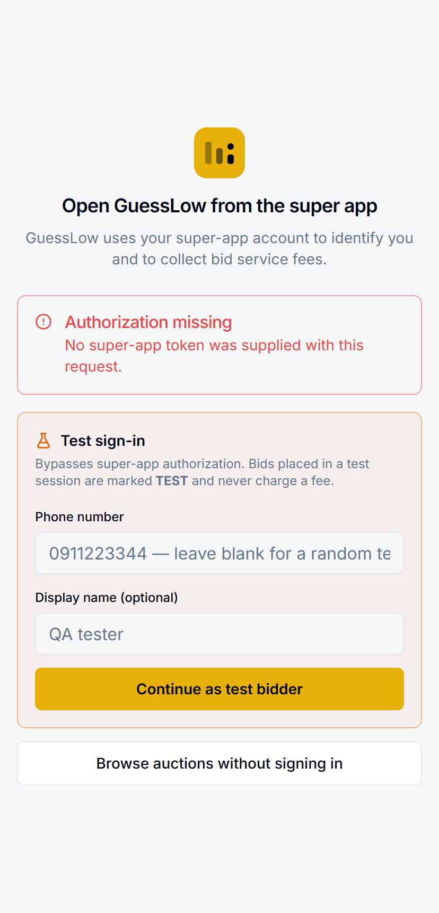

*The `/connect` entry screen. In production the super app supplies a token and this
screen is never seen — the customer lands directly on the page they tapped. The
**Test sign-in** panel shown here appears only when `ALLOW_TEST_LOGIN=true`.*

### Testing without the super app

For UAT and demos, set `ALLOW_TEST_LOGIN=true` and `/connect` grows the **Test sign-in**
panel above.

**To start a test session:**

1. Open `/connect?test=1`.
2. Enter any phone number — or leave it blank for a generated one.
3. Optionally give the tester a display name.
4. Tap **Continue as test bidder**.

A test session is fenced in on every side: an orange bar sits across the top of every
screen, the console dashboard warns that the bypass is live, the payment gateway is
skipped entirely so bids record a **zero fee**, and every bid is stored with
`channel = TEST` so it can be filtered out and never inflates revenue. Every other rule
— bid range, step grid, per-bidder cap, cooldown, the no-repeating-your-own-amount rule —
still applies, so the flow is exercised honestly.

> ⚠️ **Unset `ALLOW_TEST_LOGIN` before going live.** With it on, anyone who can reach
> `/connect` can sign in as any phone number.

---

## 3. The home screen

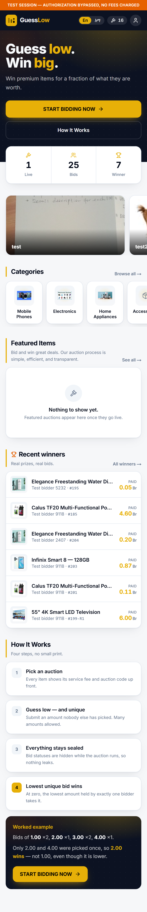

*The home screen, top to bottom.*

Reading down the page:

| Section | What it shows |
| --- | --- |
| **Hero** | The pitch, a **Start Bidding Now** button and a **How It Works** shortcut |
| **Live counters** | How many auctions are live, total bids placed, and winners so far |
| **Banner carousel** | Promotional banners, managed in the console under **Content → Banners** |
| **Categories** | Tiles that filter the auction list |
| **Featured Items** | Auctions an operator has marked as featured. Empty until one is both featured *and* live |
| **Recent winners** | Real settled results — item, winner, auction code and the winning amount |
| **How It Works** | Four steps and the worked example from [section 1](#1-the-rule-that-decides-everything) |

The orange bar at the very top (`TEST SESSION — AUTHORIZATION BYPASSED, NO FEES CHARGED`)
appears only in a test session. Customers never see it.

---

## 4. Browsing auctions

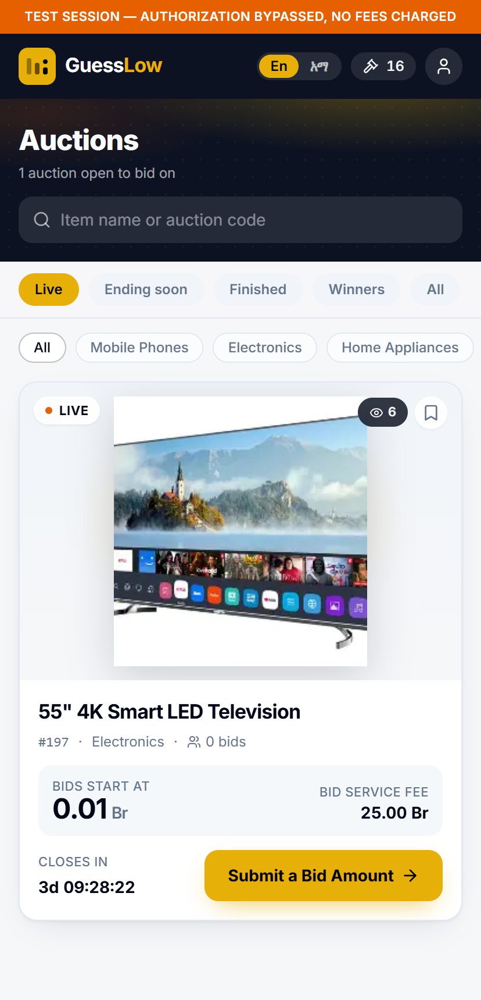

*The auction browser.*

Each card carries the item image, its status, the countdown, and the bid service fee.
Tap a card to open it.

The header is constant throughout the app:

- **En / አማ** — switch language, see [section 11](#11-profile-and-language).
- **Gavel + number** — how many bids you have placed.
- **Person icon** — your profile.

---

## 5. Reading an auction page

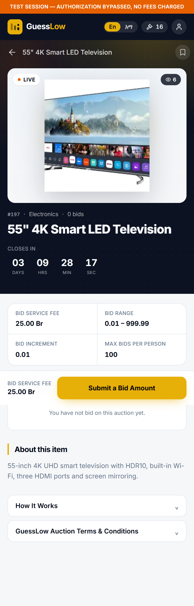

*A live auction. Everything you need to decide an amount is above the fold.*

**What each field means:**

| Field | Meaning |
| --- | --- |
| **Closes in** | Live countdown to the end time |
| **Bid service fee** | What each bid costs you, charged from your super-app wallet |
| **Bid range** | The lowest and highest amount you may submit |
| **Bid increment** | The step grid. With a `0.01` increment, `4.75` is valid and `4.752` is not |
| **Max bids per person** | How many bids you may place on this auction |
| **Your bids** | How many of that allowance you have used |

Below that sit **About this item**, a **How It Works** accordion, and the
**Terms & Conditions** that apply to this specific auction.

The sticky bar at the bottom repeats the fee and holds the **Submit a Bid Amount**
button, so it is always under your thumb.

---

## 6. Placing a bid

Placing a bid is a three-step flow. Nothing is charged and nothing is registered until
the last step.

### Step 1 — Choose your amount

Tap **Submit a Bid Amount**. A sheet slides up from the bottom of the screen.

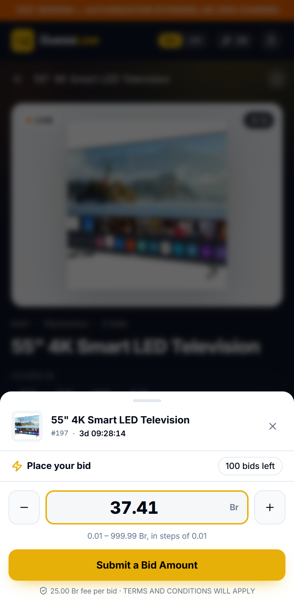

*The bid sheet. Type an amount, or use **−** and **+** to move one increment at a time.*

- The pill at the top right (**100 bids left**) is your remaining allowance on this auction.
- The line under the field restates the range and the step: `0.01 – 999.99 Br, in steps of 0.01`.
- You cannot submit an amount you have already used on this auction.

Tap **Submit a Bid Amount** in the sheet to continue.

### Step 2 — Confirm and accept the terms

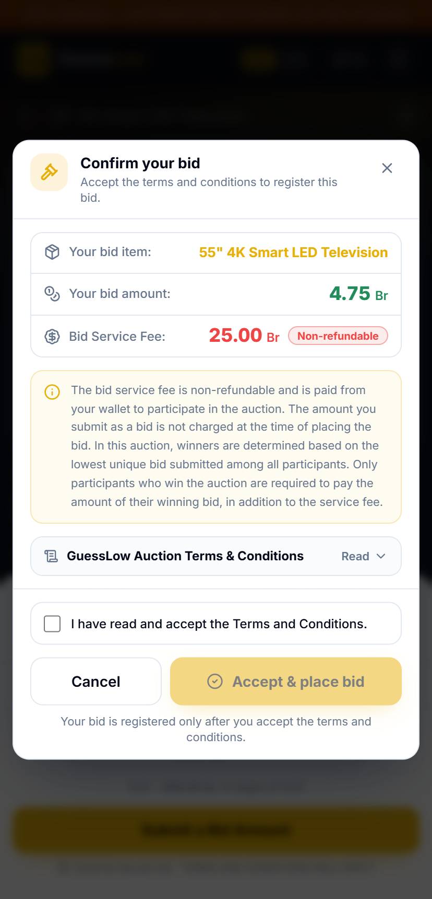

*The confirmation dialog. **Accept & place bid** is greyed out until the checkbox is ticked.*

This screen is the last point at which nothing has happened yet. It restates:

- **Your bid item** and **your bid amount**.
- **The bid service fee**, marked **Non-refundable**.
- That the bid amount itself is *not* charged when you place the bid — only the winner
  pays their winning amount, in addition to the service fee.

Tick **I have read and accept the Terms and Conditions**.

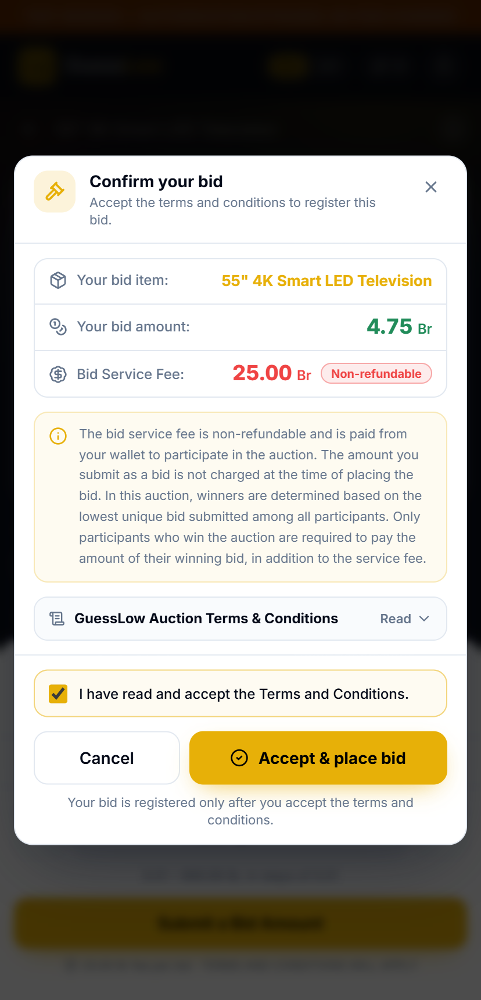

*With the box ticked, **Accept & place bid** becomes active.*

### Step 3 — Place it

Tap **Accept & place bid**. In production the super-app wallet is charged for the
service fee at this point, and the mini-app shows *confirming payment* until the gateway
confirms. **A bid only counts once its fee is confirmed.**

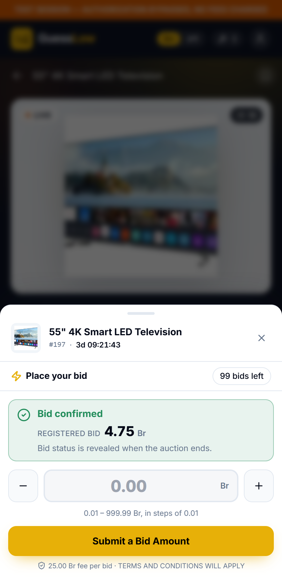

*Confirmed. The amount is registered, the allowance drops to **99 bids left**, and the
field resets so you can immediately place another.*

Note the line **"Bid status is revealed when the auction ends."** You are told your bid
is in, but not whether it is currently unique — see the next section.

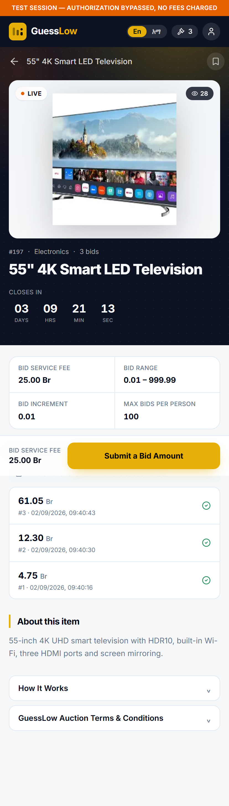

*Back on the auction page, **Your bids** now reads 3/100 and your own amounts are listed.*

### If a bid is rejected

The platform refuses a bid, with a message, when any of these is true:

- The terms checkbox was not ticked.
- The auction is not `LIVE`, or the platform is in maintenance mode.
- Your account is not `ACTIVE` (suspended or blocked — see [Bidders](#21-bidders)).
- The amount is outside the bid range, or off the increment grid.
- You have reached the per-bidder cap, or the auction-wide cap has been reached.
- You already used that exact amount on this auction.
- You are inside the cooldown window since your last bid.
- The auction is invite-only and your number is not on its participant list.

---

## 7. Why you cannot see other people's amounts

In a lowest-unique-bid auction the amounts *are* the game. So GuessLow never stores an
amount in the clear and never sends one to a device that is not entitled to it.

**While an auction runs, you can see your own amounts and nothing else.** Everyone
else's show as `•••`. This applies to staff too — the console masks amounts in exactly
the same way (see [section 16](#16-bids)).

Disclosure is granted on exactly two grounds:

1. **You placed the bid.** You typed it in, so you can always read it back.
2. **The auction has settled.** From that moment the result is public.

An `ENDED` auction does **not** reveal amounts. An ended auction can still be re-settled
or extended by a late payment callback, so its bid space is still live information.

---

## 8. My Bids

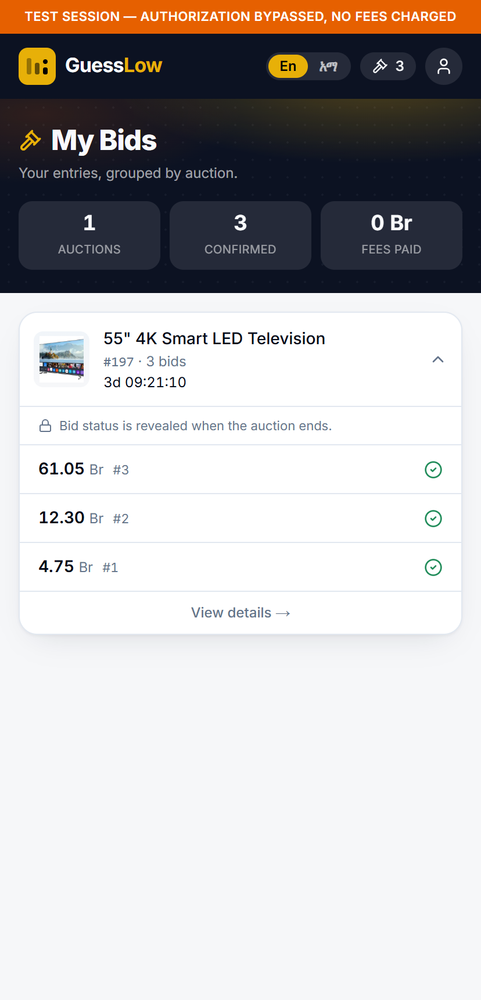

*My Bids — your entries, grouped by auction.*

The banner counts the auctions you are in, your confirmed bids, and the fees you have
paid. Each auction is a card you can collapse, with the countdown and the bids you placed
on it, newest first, numbered in the order you made them.

While an auction is live, a padlock line sits above your bids: **"Bid status is revealed
when the auction ends."** Your amounts are shown — they are yours — but nothing tells you
whether they are still unique, because nothing can. **View details** opens the auction.

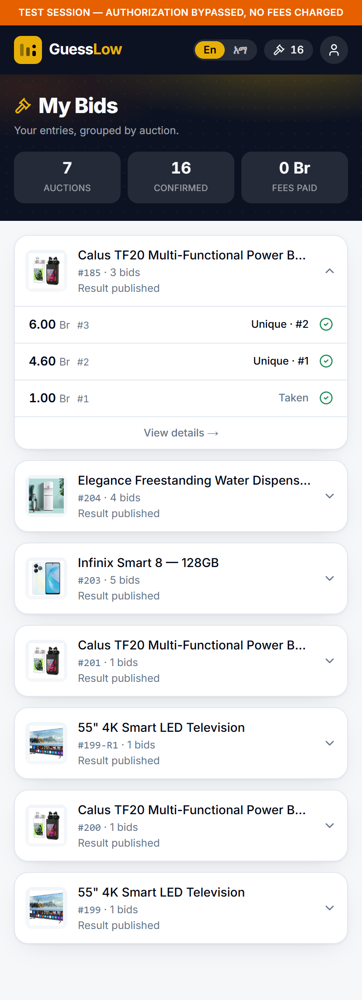

*The empty state, for an account that has not bid yet.*

---

## 9. When an auction settles

When an auction ends and settles, the result is published and the amounts open up.

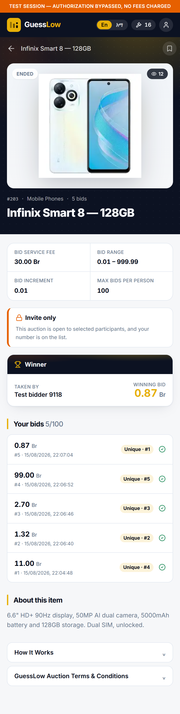

*A settled auction — the moment the amounts open up.*

Three things appear that were not there while it ran:

- **The Winner panel** — who took it, and the winning bid (`0.87 Br`).
- **Your bids, now ranked.** Each of your amounts carries a badge: `Unique · #1`,
  `Unique · #2`, and so on. Before settlement these read only as registered.
- **The full result**, reachable from Wins via *See how this was decided*.

The **Invite only** notice near the top appears on restricted auctions, and tells you
whether your number is on the list.

Settlement itself works like this:

1. Every **confirmed** bid is loaded. Bids whose fee never landed are excluded by construction.
2. Bids are grouped by amount, compared as exact 2-decimal strings — so `2` and `2.00`
   are the same amount, and floating-point rounding can never merge or split a group.
3. Amounts held by **exactly one** bid are kept and sorted ascending. Rank 1 wins.
4. The result snapshot is written with the winner and a configured number of runner-ups,
   every bid is stamped with its uniqueness and rank, a `Winner` record is created with a
   claim deadline, and the auction moves to `SETTLED`.

### The bid ledger

Once an auction settles, the platform can publish a **bid ledger**: every amount that was
bid and how many bids landed on it. That is what lets a customer check the result for
themselves — that the amounts cheaper than the winning one were all matched by someone
else, and that the winning one was not.

Two settings govern it (**Settings → Bid Visibility**): whether the ledger is published
at all, and whether bidders are **named** in it. The second is off by default and marked
sensitive — the counts alone prove the result, whereas a masked number seen across every
auction a bidder takes part in would make them traceable between rounds.

**An auction can settle with no winner.** That happens when no amount is unique, or when
the auction closes with fewer confirmed bids than its turnout floor (`reauctionMinBids`) —
a guard that stops a three-bid auction handing over a television. Either way the item is
not awarded, and the auction becomes a candidate for re-auction
([section 12](#12-re-auctions-when-nobody-wins)).

---

## 10. Wins and claiming a prize

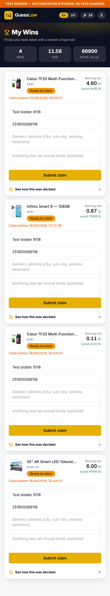

*My Wins. The banner totals your wins, what you paid, and the retail value of what you took.*

Each win card shows the item and auction code, your **winning bid**, how much you
**saved** against the retail value, a **Ready to claim** badge, and the deadline —
*Claim before 20/08/2026, 09:55:07*.

**To claim a prize:**

1. Open **Wins**.
2. On the card for the prize, check your name and phone number are right.
3. Enter your **delivery address** (city, sub-city, woreda, landmark).
4. Add anything else the team should know — optional.
5. Tap **Submit claim**, before the deadline shown in orange.

**See how this was decided** opens the auction's published result, so you can check the
ranking that awarded you the prize.

Your claim then moves through the console:

`Awaiting claim` → `Claimed` → `Verified` → `Delivered`

If the window closes with no claim, the prize is **forfeited** and an operator may
promote the runner-up.

---

## 11. Profile and language

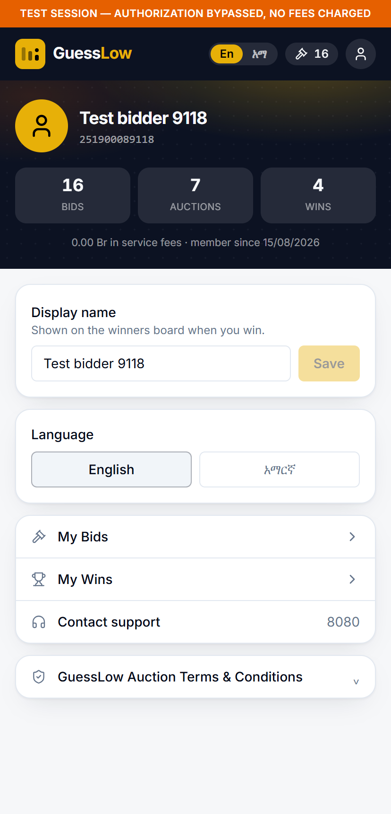

*Profile.*

The banner carries your phone number, how many bids you have placed, across how many
auctions, how many you have won, the service fees you have paid, and when you joined.

Below it:

- **Display name** — *shown on the winners board when you win*. Edit it and select **Save**.
- **Language** — English or አማርኛ.
- Shortcuts to **My Bids** and **My Wins**, and a **Contact support** number.
- The **Terms & Conditions** in full.

The whole mini-app is bilingual. The **En / አማ** toggle in the header does the same job as
the Language control here, and the choice is stored against the bidder, so it survives
across sessions and devices.

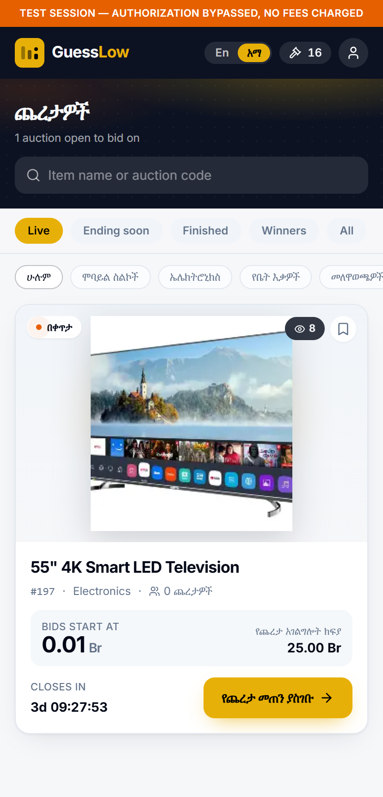

*The same auction browser in Amharic.*

---

## 12. Re-auctions: when nobody wins

An auction that closes without a valid winner can be re-run instead of written off. Each
re-run is a real auction in its own right — same item, same rules — with a code that
extends the original: `199` → `199-R1` → `199-R2`.

**Nobody pays twice.** When a new round opens, every bid you already paid for anywhere in
that chain becomes a credit you can spend on the new round:

> Paid for 5 bids, then place 8 in the re-auction → **5 are free, 3 are charged.**

Those 3 join the pool, so a third round would grant you 8 credits. Across the whole chain
you only ever pay for the largest single round you played.

Everyone from the previous round is notified when a new round opens — that the auction is
being re-run, how many paid bids came with them, and from which bid a fee starts again. If
a round is closed to you (some rounds admit only new bidders, or only previous ones), you
are told that instead.

---

# Part B — The operations console

The console lives at `/admin`. It is organised into five groups in the left sidebar:

| Group | Modules |
| --- | --- |
| **Operations** | Dashboard, Auctions, Bids, Winners, Payments |
| **Catalog** | Items, Categories, Content |
| **Customers** | Bidders, Notifications |
| **Governance** | Approvals, Reports, Audit Logs |
| **System** | Users, Access Control, Settings |

You only see the modules your role can read.

---

## 13. Signing in

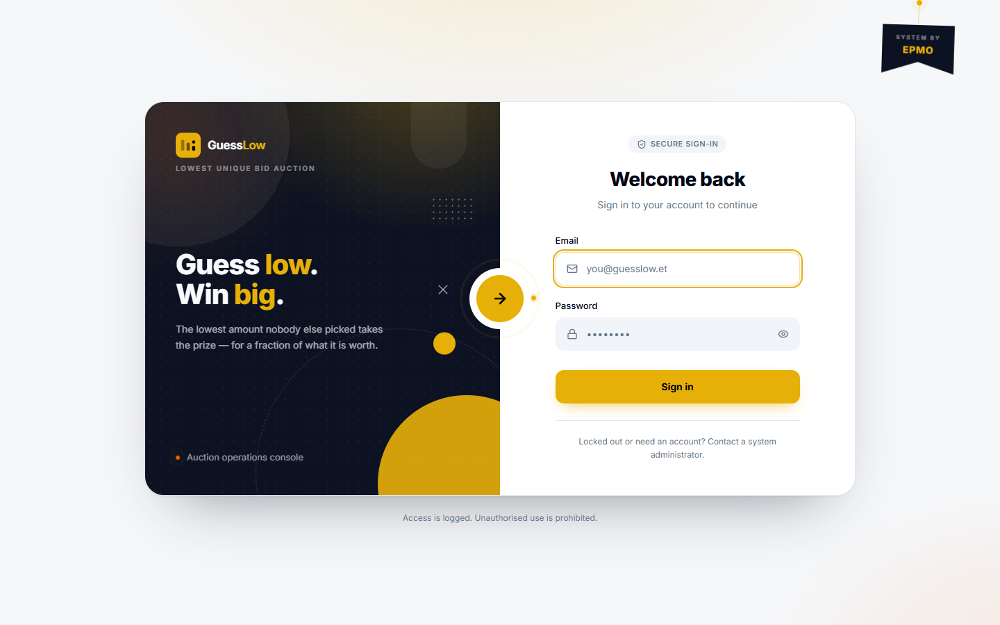

*The console sign-in screen.*

**To sign in:**

1. Go to `/admin`. You are redirected to the sign-in screen.
2. Enter your email address and password.
3. Select **Sign in**.

A few things to know:

- Failure messages are deliberately identical for "no such user" and "wrong password",
  so the form cannot be used to discover which addresses exist.
- Repeated failures lock the account for a configurable period
  (**Settings → Security & Governance**).
- New accounts, and accounts issued a one-time password, are forced to
  `/admin/change-password` on first sign-in before they can go anywhere else.

---

## 14. The dashboard

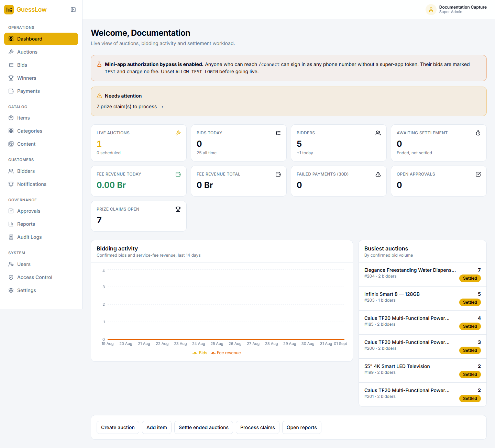

*The dashboard. Everything that needs a decision today is above the chart.*

**The needs-attention band** sits directly under the title and links straight to the work —
here, seven prize claims to process. When the mini-app authorization bypass is enabled, a
second warning band appears above it, as shown.

**The tiles**, left to right and top to bottom:

| Tile | Meaning |
| --- | --- |
| **Live auctions** | Running now, with how many are scheduled to follow |
| **Bids today** | Confirmed bids today, and the all-time total |
| **Bidders** | Registered customers, and how many arrived today |
| **Awaiting settlement** | Auctions that have ended but not yet settled |
| **Fee revenue today / total** | Service fee income |
| **Failed payments (30d)** | Fee collections that did not complete |
| **Open approvals** | Maker-checker requests waiting on a second pair of eyes |
| **Prize claims open** | Winners who have not completed a claim |

**Bidding activity** charts confirmed bids and fee revenue over the last 14 days.
**Busiest auctions** ranks by confirmed bid volume. The buttons along the bottom jump
to the common tasks: create an auction, add an item, settle ended auctions, process
claims, open reports.

---

## 15. Auctions

The auction module carries the full lifecycle:

`DRAFT` → `SCHEDULED` → `LIVE` → `ENDED` → `SETTLED`, with `CANCELLED` and
`PENDING_APPROVAL` off to the side.

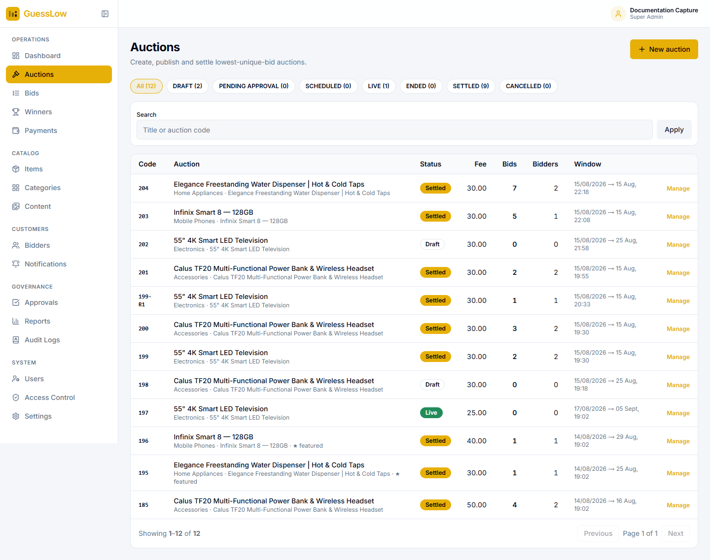

*The auction list.*

The chips across the top filter by status and carry a live count each — `All (12)`,
`DRAFT (2)`, `LIVE (1)`, `SETTLED (9)` and so on — so the shape of the workload is
readable at a glance. Search by title or auction code.

Each row gives the auction code, item and category, status, bid fee, how many bids and
distinct bidders it drew, and its window. Auctions marked **★ featured** say so under the
title. Re-auction rounds appear as their own rows with the extended code (`199-R1`).

**Manage** on the right opens the auction. **New auction** (top right) starts a draft.

### Creating an auction

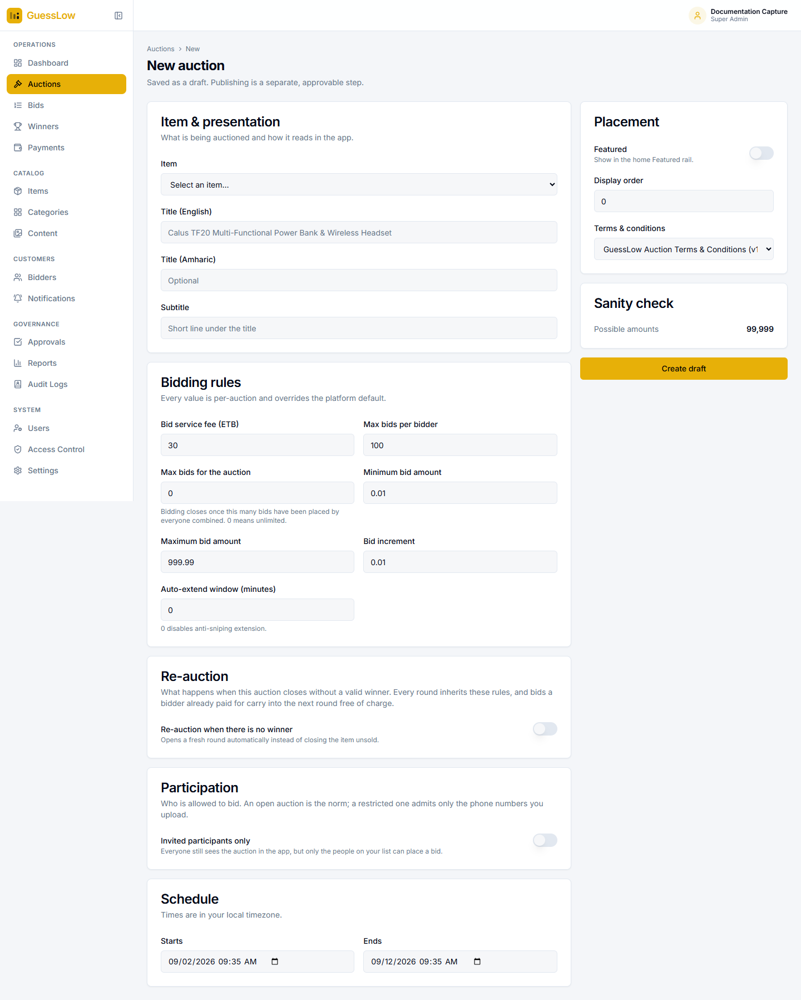

*The New auction form. It saves as a draft — publishing is a separate step.*

**To create an auction:**

1. Go to **Auctions → New auction**.
2. **Item & presentation** — pick the item from the catalogue. The English title fills
   in from the item; override it, add an Amharic title, and add a subtitle if you want.
3. **Bidding rules** — every value here is per-auction and overrides the platform default:
   - **Bid service fee** — what each bid costs the customer.
   - **Max bids per bidder** — the per-person cap.
   - **Max bids for the auction** — bidding closes once this many bids have been placed by
     everyone combined. `0` means unlimited.
   - **Minimum / maximum bid amount** — the range customers may choose within.
   - **Bid increment** — the step grid.
   - **Auto-extend window (minutes)** — anti-sniping. A bid inside this window of the end
     time pushes the end time out. `0` disables it.
4. **Re-auction** — switch on **Re-auction when there is no winner** to expose the round
   limit, round duration, start delay, who may take part, and the turnout floor. Every
   round inherits these rules, and bids a bidder already paid for carry into the next
   round free of charge.
5. **Participation** — leave open, or switch on **Invited participants only** and attach
   an uploaded list of phone numbers. Everyone still *sees* the auction; only people on
   the list can bid.
6. **Schedule** — set the start and end times, in your local timezone.
7. **Placement** (right rail) — mark it **Featured** to put it on the home rail, set the
   display order, and choose which version of the terms & conditions applies.
8. Check the **Sanity check** panel, then select **Create draft**.

> **The Sanity check panel is worth reading before you publish.** It reports how many
> distinct amounts the bid range and increment actually allow (99,999 in the screenshot
> above) and the break-even bid count. A narrow range with many bidders produces
> duplicates everywhere and auctions that end with **no winner at all**.

### Monitoring a live auction

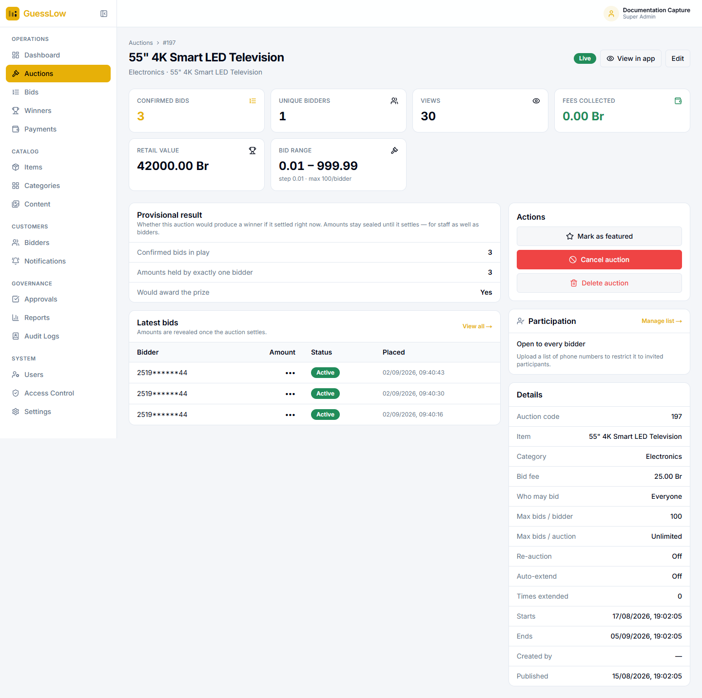

*A live auction. Note the masked amounts and the **Provisional result** panel.*

The **Provisional result** panel answers the only question worth asking mid-auction —
*would this auction produce a winner if it settled right now?* — without disclosing the
bid space:

| Row | Meaning |
| --- | --- |
| **Confirmed bids in play** | Bids whose fee has landed |
| **Amounts held by exactly one bidder** | How many amounts are currently unique |
| **Would award the prize** | Whether a winner exists right now |

The **Latest bids** table below it shows who bid and when, with the amount masked as
`•••` and the header note *"Amounts are revealed once the auction settles."* This is
deliberate: staff are not exempt from bid confidentiality.

The **Actions** rail offers **Mark as featured**, **Cancel auction** and **Delete
auction**. An auction that has been public is cancelled, never deleted. **Participation**
shows whether the auction is open or restricted, with a link to manage the list.
**Details** is the full rule set as configured.

### A settled auction

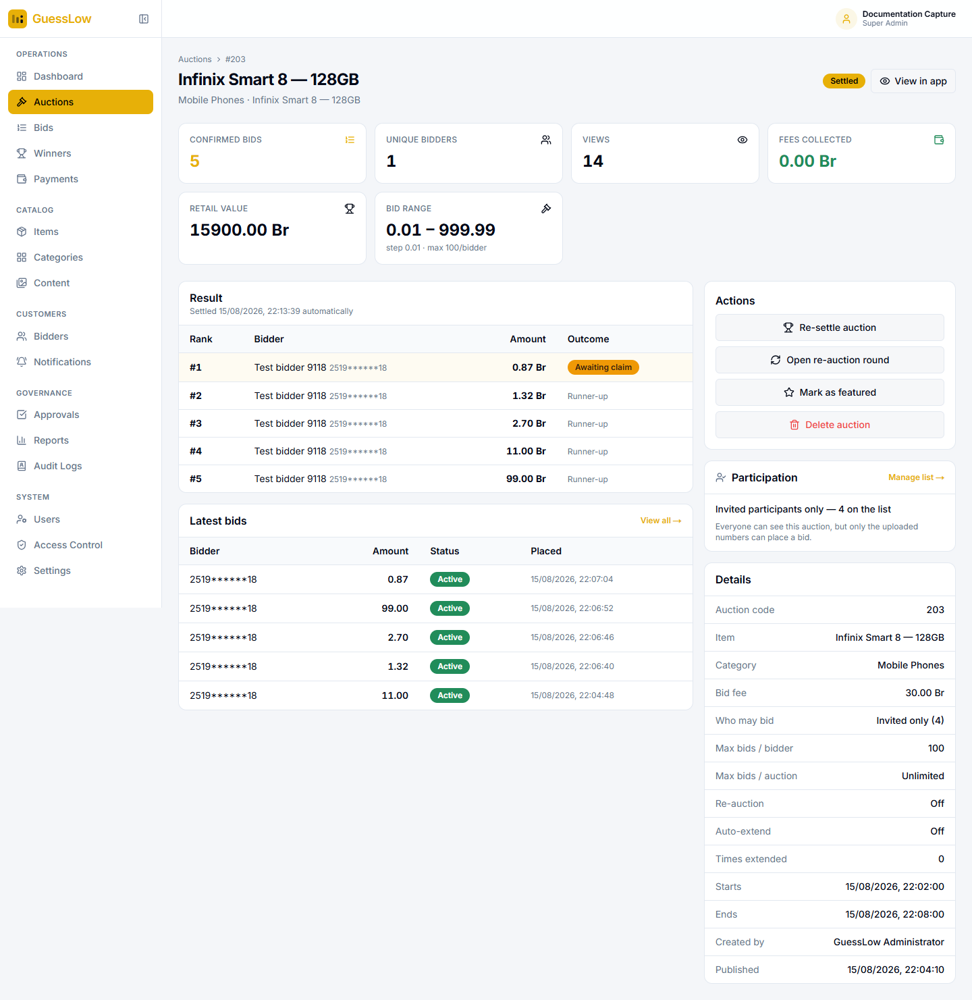

*A settled auction. The result table is now fully open — rank, bidder, amount, outcome.*

The **Result** panel shows the winner at rank 1 and the configured depth of runner-ups,
each with its amount and outcome. **Actions** now offers:

- **Re-settle auction** — discards the previous snapshot and recomputes, for use after a
  dispute. Re-settling never forks a chain that has already produced a re-auction round.
- **Open re-auction round** — manually open the next round.
- **Mark as featured** / **Delete auction**.

Settlement is idempotent, so re-running it is safe. Both settling and re-settling can be
routed through maker-checker (**Settings → Security & Governance**).

### The re-auction chain

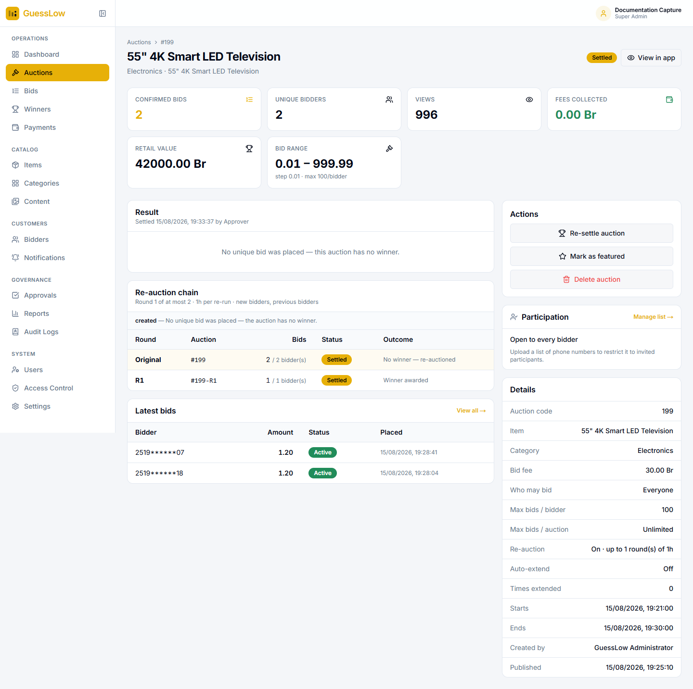

*Auction #199 — a textbook no-winner outcome, and the re-run that resolved it.*

This one screenshot contains the whole rule. Auction #199 took **two** confirmed bids,
and the **Latest bids** table shows why it produced nothing: both bidders submitted
`1.20`. With no amount held by exactly one bidder, the **Result** panel reads
*"No unique bid was placed — this auction has no winner."*

The **Re-auction chain** panel below it shows what happened next:

| Round | Auction | Bids | Status | Outcome |
| --- | --- | --- | --- | --- |
| Original | #199 | 2 / 2 bidders | Settled | No winner — re-auctioned |
| R1 | #199-R1 | 1 / 1 bidder | Settled | Winner awarded |

The header line states the chain's rules — *Round 1 of at most 2 · 1h per re-run · new
bidders, previous bidders* — so you can see at a glance how many rounds remain and who is
admitted to them. Both bidders' paid bids carried into R1 as free credits.

Note that the **Actions** rail here offers **Re-settle auction** but not **Open
re-auction round**: this chain has already produced a round, and re-settling never forks
a chain that has.

### Editing and participants

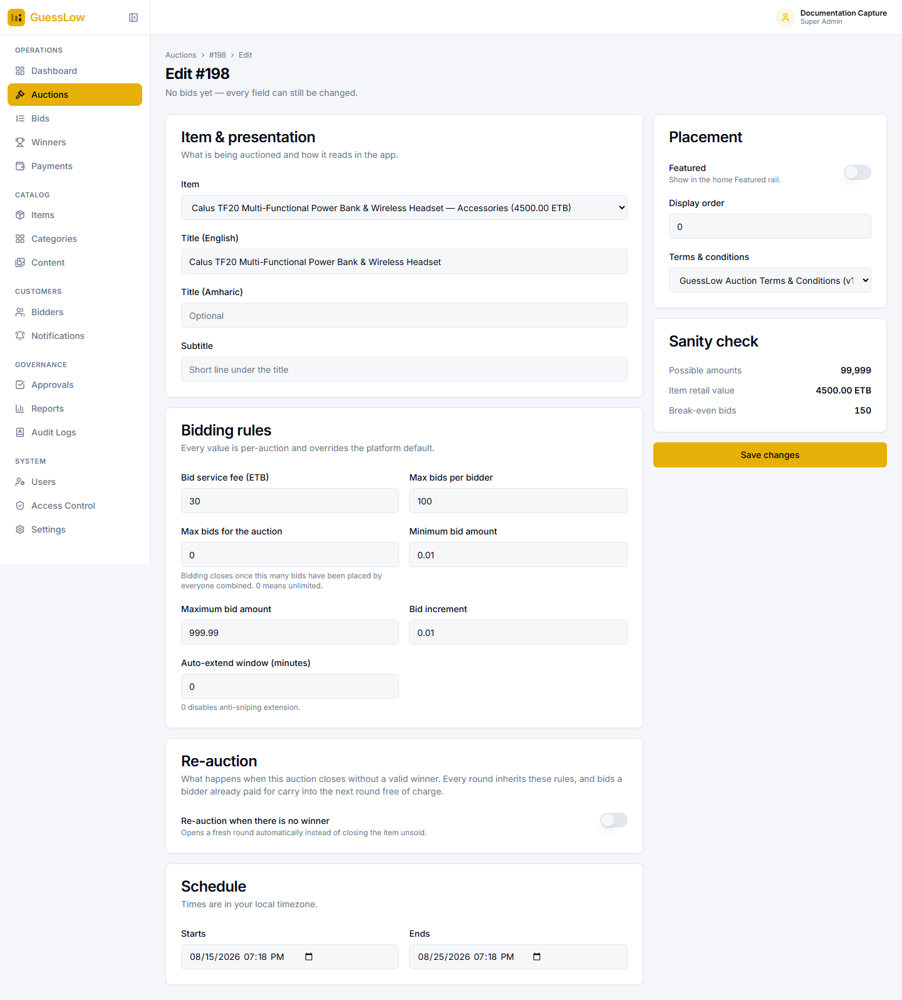

*Editing an auction.*

> **Economics lock as soon as a bid is placed.** The fee and the bid range cannot be
> changed once anyone has bid — changing them mid-auction would retroactively invalidate
> bids people paid for.

### Restricting who may bid

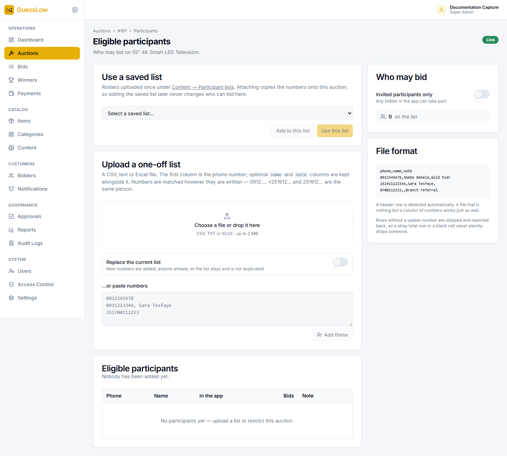

*Eligible participants — three ways to say who may bid on this auction.*

Reach this from an auction's **Participation** panel via **Manage list →**.

**Option 1 — use a saved list.** Rosters uploaded once under **Content → Participant
lists** appear in the picker. **Add to this list** appends them; **Use this list**
replaces what is there.

> Attaching a saved list **copies** the numbers onto this auction. Editing the saved list
> afterwards never changes who can bid here — which is what you want, because eligibility
> on a running auction should not move under people's feet.

**Option 2 — upload a one-off list.** Drop a CSV, TXT or XLSX file (up to 2 MB). The
first column is the phone number; optional `name` and `note` columns are kept alongside
it. A header row is detected automatically, and a file that is nothing but a column of
numbers works just as well.

**Numbers are matched however they are written** — `0912...`, `+251912...` and
`251912...` are the same person. Rows without a usable number are skipped **and reported
back**, so a stray total row or a blank cell never silently drops someone.

Leave **Replace the current list** off to add to the existing list without duplicating
anyone; switch it on to start over.

**Option 3 — paste numbers** straight into the box, one per line, optionally with a name
after a comma. Select **Add these**.

Finally, switch **Invited participants only** on in the **Who may bid** panel. Until you
do, the list is stored but the auction stays open to everyone. The counter beside it
shows how many numbers are on the list.

The **Eligible participants** table at the bottom lists everyone admitted, showing
whether each number already exists in the app and how many bids they have placed.

---

## 16. Bids

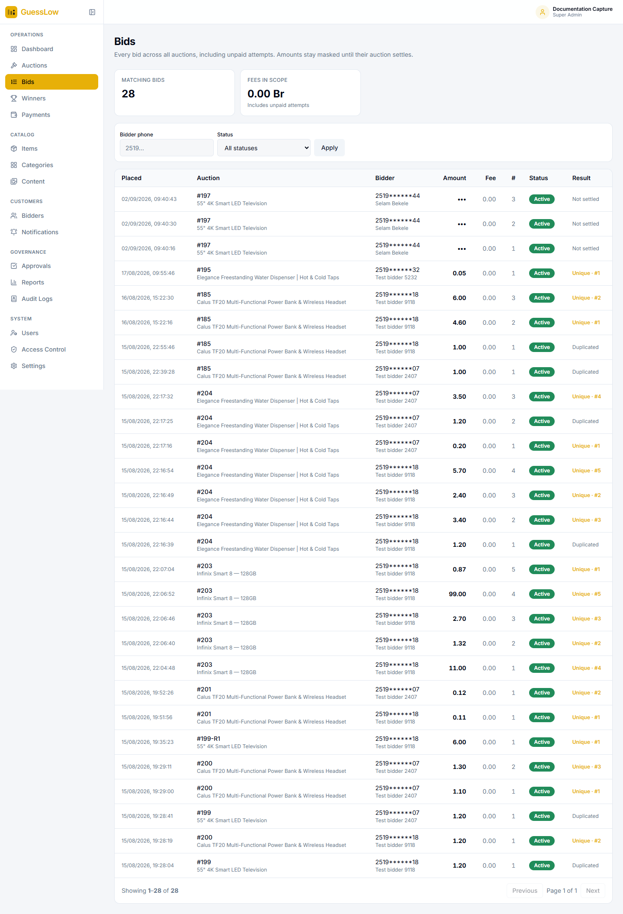

*Every bid on the platform, including unpaid attempts. The masking boundary is visible in
a single view.*

The top three rows are bids on live auction **#197**: their amounts read `•••` and the
**Result** column says *Not settled*. Every row below them belongs to a settled auction,
so the amount is open and the result is stated — `Unique · #1` for the winner, `Unique · #3`
for a runner-up, and **`Duplicated`** for an amount two or more people picked, which is
exactly why those bids lost.

Filter by bidder phone or status and select **Apply**. The tiles above count matching
bids and the fees in scope, including unpaid attempts.

The **#** column is the bidder's own bid number on that auction — their first, second,
third and so on.

---

## 17. Winners

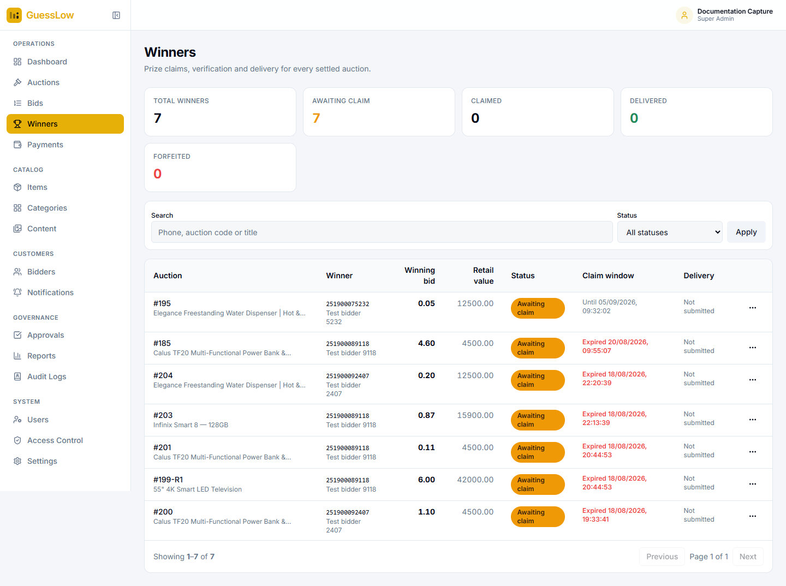

*The Winners module: claim, verification and delivery for every settled auction.*

The tiles across the top count total winners, awaiting claim, claimed, delivered and
forfeited. The table lists each winner with the auction, the winning bid, the retail
value of the prize, the claim status, the claim window (turning red once expired) and
the delivery state.

**The claim lifecycle:**

| Status | Meaning | What you do |
| --- | --- | --- |
| `PENDING_CLAIM` | Winner notified, claim window open | Wait, or send a reminder |
| `CLAIMED` | Winner has submitted their claim | Verify their identity and details |
| `VERIFIED` | Claim checked and accepted | Arrange and record delivery |
| `FULFILLED` | Prize delivered | Done |
| `FORFEITED` | Claim window expired unclaimed | Optionally promote the runner-up |

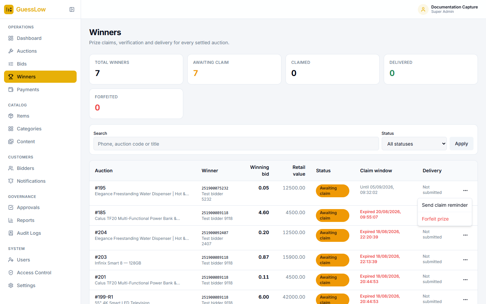

*The **⋯** menu on each row carries the actions available at that stage.*

**To act on a winner:** open the **⋯** menu on their row and choose the action. For a
winner still awaiting a claim, that is **Send claim reminder** or **Forfeit prize**.

---

## 18. Payments

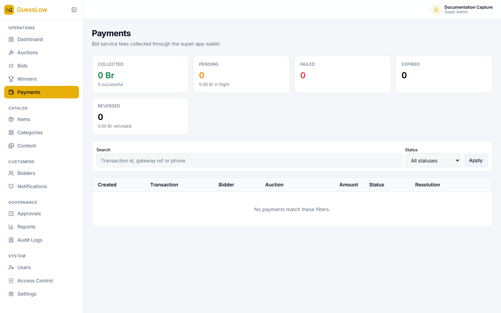

*Payments — reconciliation for bid service fees collected through the super-app wallet.
The table is empty here because every bid in this environment was placed in a test
session, which skips the gateway and records a zero fee.*

The tiles count **Collected**, **Pending**, **Failed**, **Expired** and **Reversed**,
each with its value. Search by transaction id, gateway reference or phone number, and
filter by status.

Three behaviours worth knowing:

- **Idempotency.** Gateways retry. Confirming a bid that is already active returns early,
  so counters can never be double-incremented.
- **Late payments.** If a fee lands after its bid was voided — the auction closed first —
  the transaction is marked `REVERSED` and flagged for refund rather than silently kept.
- **Timeouts.** Bids stuck awaiting payment past `payments.pendingTimeoutMinutes` are
  voided automatically by the scheduled maintenance pass.

Staff with the `approve` right can manually confirm, fail, or refund a transaction from
this page.

---

## 19. Items and Categories

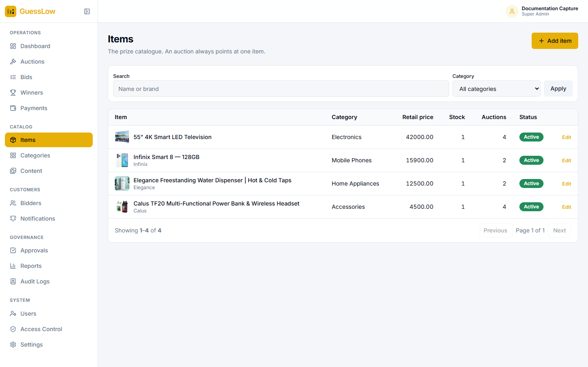

*The prize catalogue.*

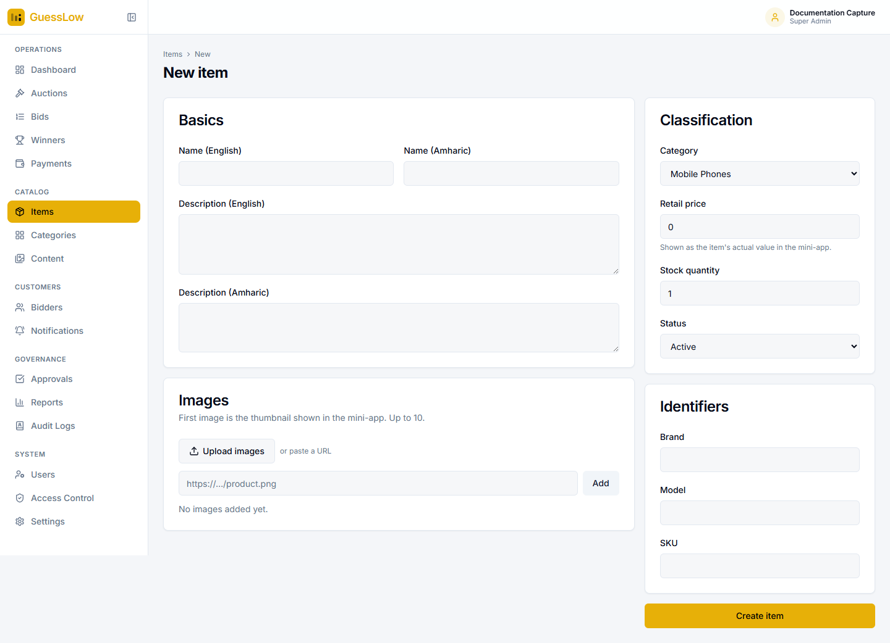

*Creating an item.*

**To add an item:**

1. Go to **Items → New item**.
2. **Basics** — the name and description, in English and Amharic.
3. **Images** — up to 10. **The first image is the thumbnail** shown in the mini-app.
   Use **Upload images** for a file from your device, or paste a URL and select **Add**.
4. **Classification** — category, **retail price** (shown as the item's actual value in
   the mini-app, and what the reports charge against the prize), stock quantity, and
   whether the item is active.
5. **Identifiers** — brand, model and SKU.
6. Select **Create item**.

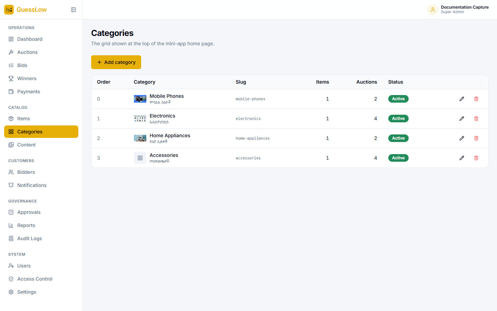

*Categories — the top-level grouping customers browse by.*

> Items still referenced by an auction are **deactivated instead of deleted**, so history
> stays intact.

### Image uploads

Every artwork field — item photos, category artwork and home banners — takes a file from
your device (drag it onto the drop zone or use the picker), with "use a URL instead" still
available for artwork already on a CDN.

Uploads are capped at **5 MB**. The format is identified by **magic number**, not by the
file extension or the declared MIME type, and only PNG, JPEG, WebP, GIF and AVIF are
accepted. **SVG is refused**, because it can carry script that would then run from the
platform's own origin. The stored filename is generated by the server, so path traversal
and overwrites are impossible, and every upload is written to the audit log.

---

## 20. Content

Content is one page with five separately-permissioned tabs. A role can be granted some
tabs and not others; a tab with nothing ticked is hidden entirely.

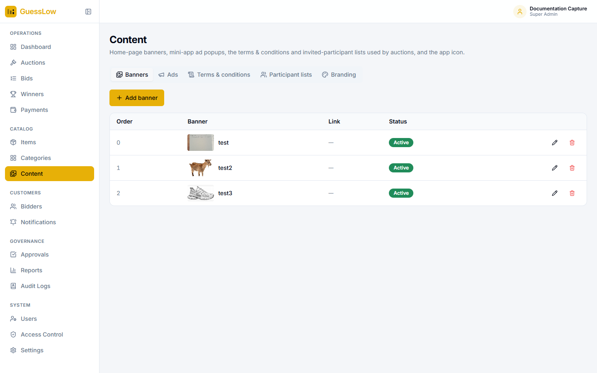

***Banners*** — the promotional carousel on the mini-app home screen.

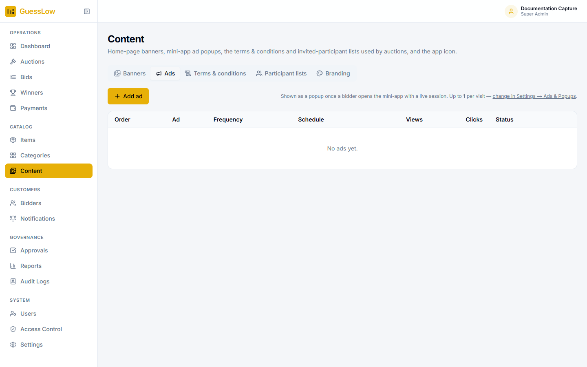

***Ads*** — a popup shown once a bidder opens the mini-app with a live session. The table
tracks order, frequency, schedule, **views**, **clicks** and status. Frequency can be
every login, once per day, or once ever; how many appear per visit and how long the app
waits before showing one are set under **Settings → Ads & Popups**. None are configured
in the screenshot above.

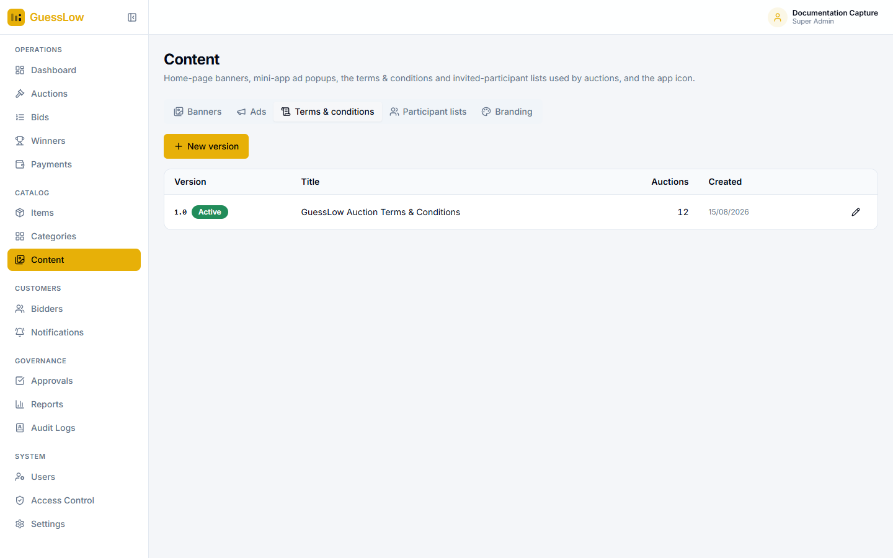

***Terms & conditions*** — versioned. Each auction pins the version that applied when it
was created, so the terms a bidder accepted are the terms on record.

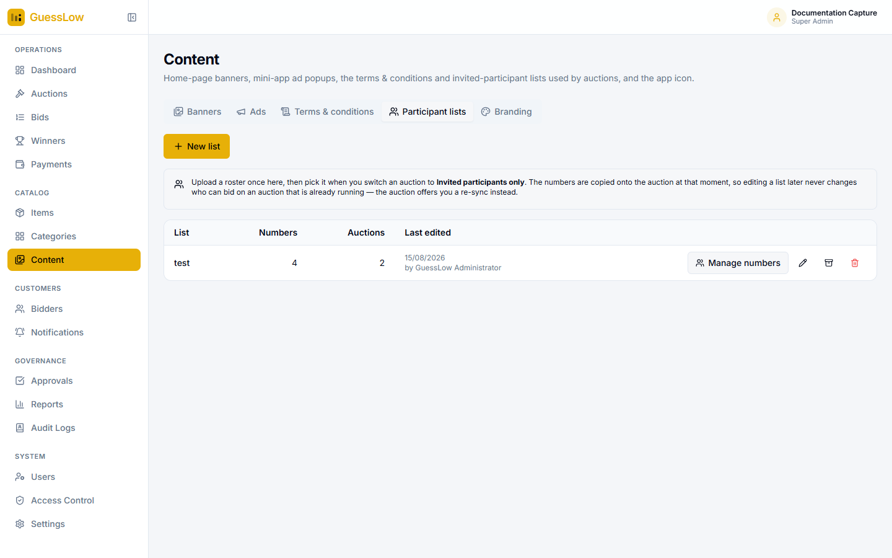

***Participant lists*** — uploaded phone-number lists that restricted auctions draw on.

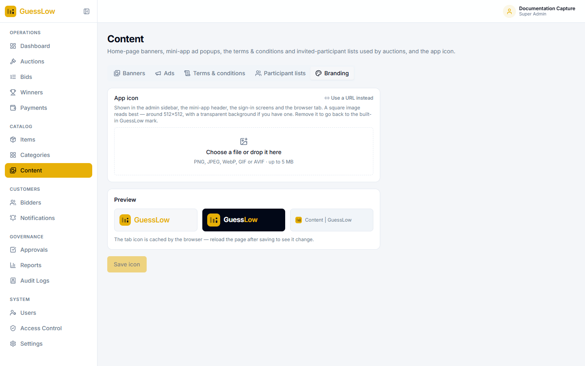

***Branding*** — the logo and brand assets the mini-app renders.

---

## 21. Bidders

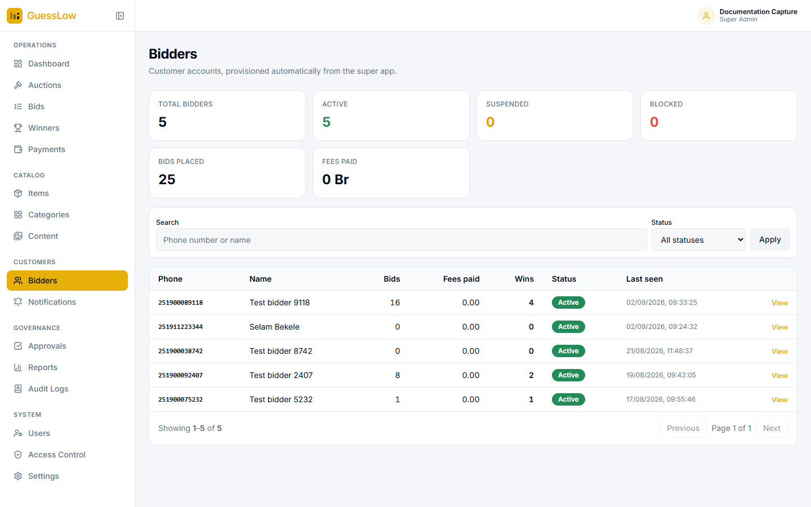

*Customer accounts.*

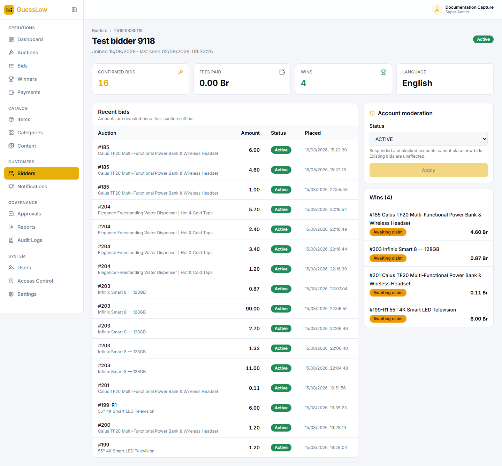

*A bidder's detail page.*

The tiles give confirmed bids, fees paid, wins, and the language they chose.
**Recent bids** lists every bid with its auction, amount, status and timestamp — under
the same masking rule, noted in the panel header: *"Amounts are revealed once their
auction settles."* **Wins** on the right lists each prize with its claim state and
winning amount.

**To moderate an account:** use the **Account moderation** panel — pick `ACTIVE`,
`SUSPENDED` or `BLOCKED` and select **Apply**.

> **Suspended and blocked accounts cannot place new bids. Existing bids are unaffected** —
> moderation stops future participation, it does not retroactively void bids someone
> already paid for.

Every moderation action records who did it and why.

---

## 22. Notifications

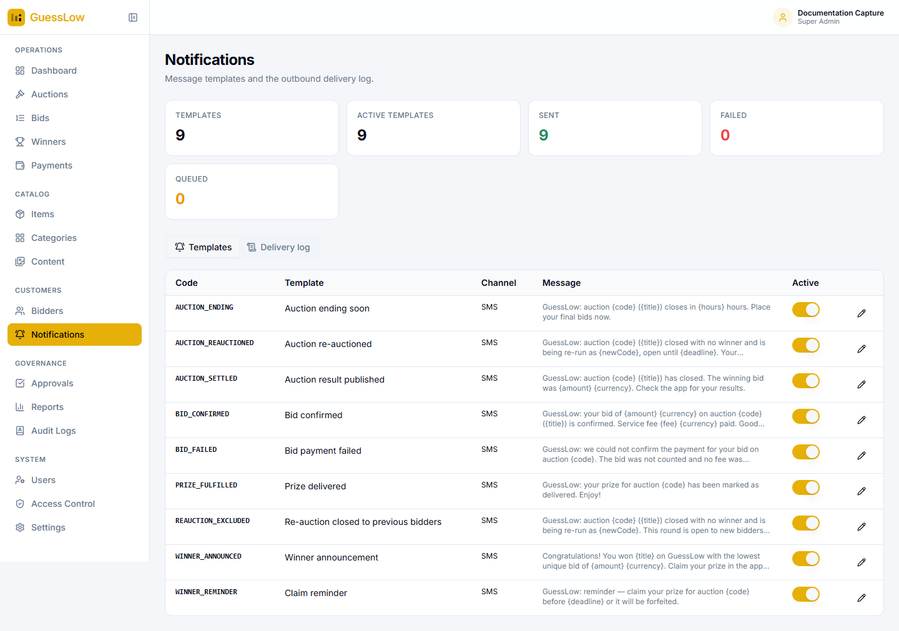

***Templates*** — the nine messages the platform sends. Each row shows the template code,
its channel, the message text and an **Active** toggle; the pencil opens it for editing
in both English and Amharic.

Messages are built from placeholders — `{code}`, `{title}`, `{amount}`, `{currency}`,
`{fee}`, `{deadline}`, `{newCode}`, `{hours}` — which the platform fills in at send time.
Switching a template off stops that message without deleting it.

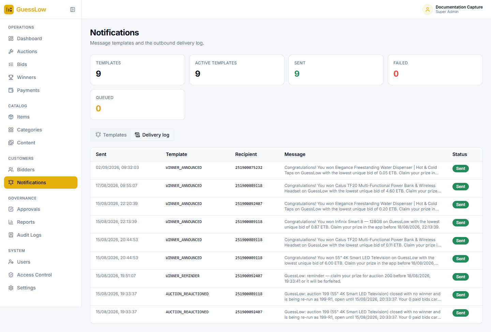

***Delivery log*** — what was sent, to whom, and whether it arrived.

Until `SMS_API_URL` is configured, messages are **logged rather than sent** — they appear
in this log but never leave the platform. See
[section 31](#31-messages-the-platform-sends) for the full catalogue.

Note that the delivery log stores bid amounts **masked**, even though the confirmation
message quotes the bidder their own amount. The log is readable by roles that must not
have the live bid distribution.

---

## 23. Approvals

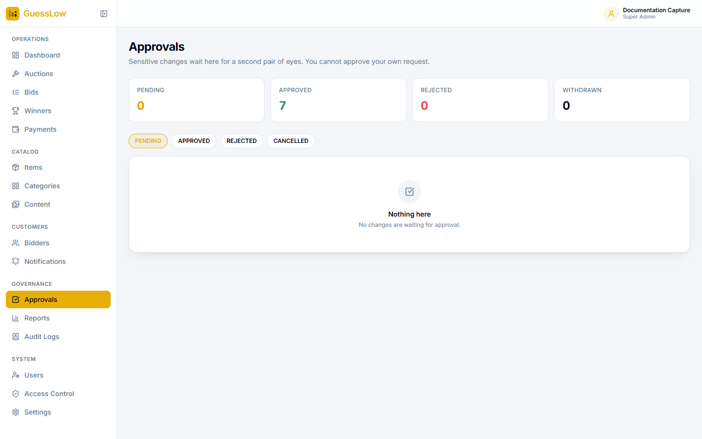

*The maker-checker queue, with nothing currently waiting. Seven requests have been
approved historically.*

When maker-checker is enabled for an action, performing it creates a pending change here
instead of applying immediately. The tiles count **Pending**, **Approved**, **Rejected**
and **Withdrawn**; the chips below them filter the list.

**To decide a request:** select it from the **PENDING** list, review the field-level diff
of what would change, and **Approve** or **Reject**.

Maker-checker can be switched on independently for publishing auctions, changing
sensitive settings, and settling auctions (**Settings → Security & Governance**).

> **Nobody can approve their own request.** The `approve` right is a second pair of eyes,
> and the platform enforces that literally.

---

## 24. Reports

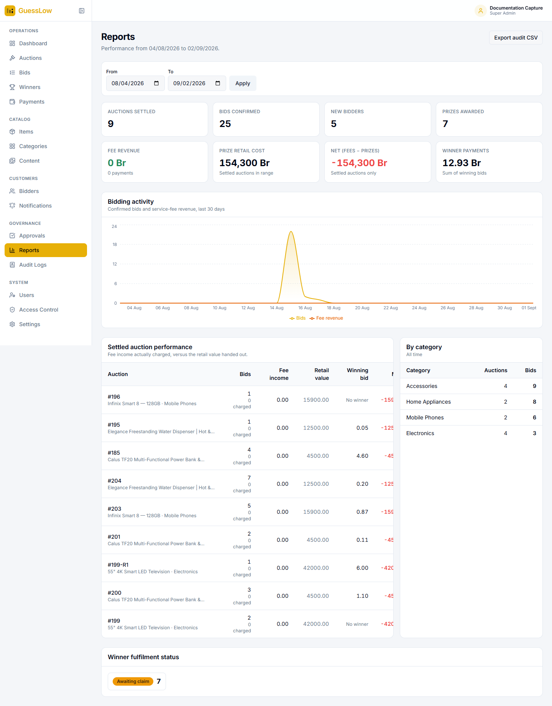

*Reports — the economics of the platform over a date range.*

Set the **From** and **To** dates and select **Apply**. Everything below responds.

**The tiles:**

| Tile | Meaning |
| --- | --- |
| **Auctions settled** | Settled inside the range |
| **Bids confirmed** | Bids whose fee landed |
| **New bidders** | Customers who arrived in the range |
| **Prizes awarded** | Winners produced |
| **Fee revenue** | Service fee income actually charged |
| **Prize retail cost** | Retail value of the prizes handed out |
| **Net (fees − prizes)** | The margin. Red means the prizes cost more than the fees brought in |
| **Winner payments** | The sum of the winning bids themselves |

**Bidding activity** charts confirmed bids and fee revenue over 30 days.

**Settled auction performance** is the per-auction detail: bids placed and how many were
actually charged, fee income, the prize's retail value, the winning bid, and the margin.
Auctions that produced no winner are marked **No winner**.

**By category** aggregates auctions and bids per category, all time.
**Winner fulfilment status** counts winners by claim stage.

**Export audit CSV** (top right) exports the underlying data.

> In the screenshot above, fee revenue is `0 Br` and every auction shows `0 charged`
> because every bid in this environment was placed in a test session, which records a
> zero fee by design. On a production database these columns carry real figures.

This is the page that tells you whether an auction's economics worked. Read it together
with the **Sanity check** panel on the auction form
([section 15](#creating-an-auction)) — the two are the before and after of the same question.

---

## 25. Audit Logs

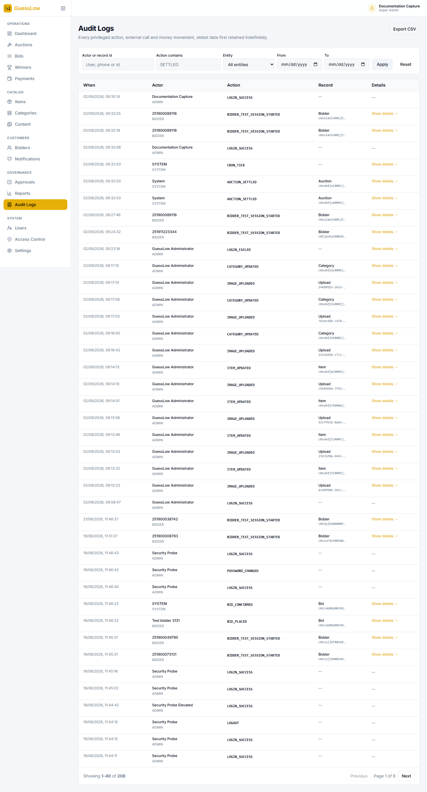

*Every privileged action, external call and money movement — retained indefinitely.*

Filter by actor or record id, by action (the **Action contains** box takes a fragment
such as `SETTLED`), by entity type, and by date range. **Show details** expands a row.
**Export CSV** exports the filtered set.

Entries cover admin sign-ins and failures, password changes, every catalogue and content
edit, image uploads, bid placement and confirmation, settlement, cron ticks, and bidder
test sessions — each stamped with who did it, when, and against which record.

Audit entries are readable only by Super Admin, Auditor and Compliance roles.

Two details matter:

- **Bid amounts are never written to the audit log at placement time.** Audit rows are
  readable while an auction is still running, which would otherwise put the live
  distribution one table away from the people who must not have it. The bid row is the
  record; the audit entry points at it. Settlement logs the *winning* amount — which is
  published from that moment anyway — but not the runner-up amounts.
- **Credentials are redacted** on write.

Only maintenance passes that changed something are logged, so a once-a-minute scheduled
tick does not add ~1,400 empty rows a day.

---

## 26. Users

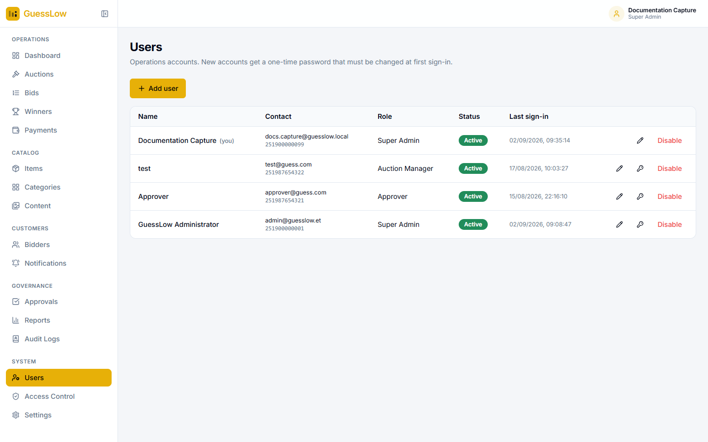

*Console accounts. Super Admin only.*

Each row shows the account's name, email and phone, its role, status and last sign-in,
with three actions on the right: **edit** (pencil), **issue a one-time password** (key)
and **Disable**. Your own row is marked *(you)* and cannot be password-reset from here —
use **Change password** instead.

**To create a user:** select **Add user**, enter their name, email and phone, assign a
role, and save. The platform issues a one-time password, which the account holder must
change at first sign-in before they can reach anything else.

> **The last active Super Admin cannot be demoted, disabled or deleted.** The platform
> refuses, so you cannot lock yourself out.

---

## 27. Access Control

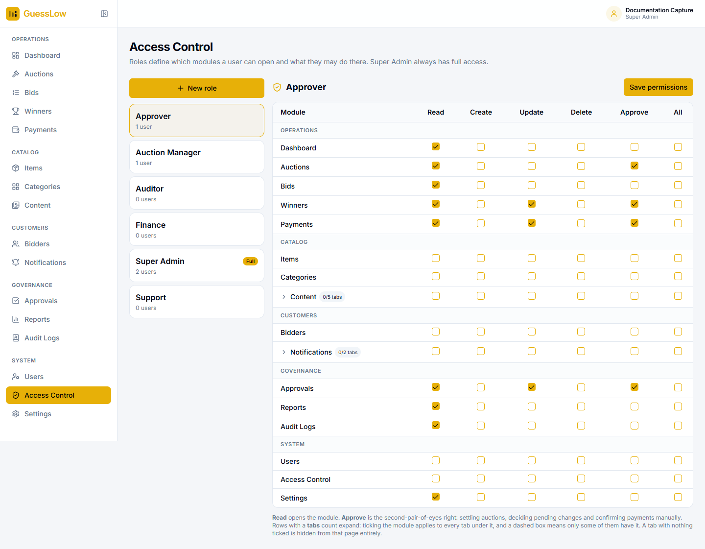

*The role permission matrix. Super Admin only.*

A role is a matrix of **read, create, update, delete, approve** per module. The module
list *is* the route registry, so adding a page to the console automatically makes it
assignable here.

**To change a role's permissions:**

1. Select the role from the list on the left.
2. Tick or untick the rights you want, module by module.
3. Expand a row with a **tabs** count (Content has 5, Notifications has 2) to grant
   individual tabs. Ticking the module applies to every tab under it; a dashed box means
   only some of them have it. **A tab with nothing ticked is hidden from that page entirely.**
4. Select **Save permissions**.

Changes take effect immediately — permissions are read fresh from the database on every
request, so revoking a role does not wait for the user's session to expire.

**What the columns mean:**

- **Read** opens the module. Without it, the module does not appear in the sidebar at all.
- **Create / Update / Delete** are the ordinary write rights.
- **Approve** is the second-pair-of-eyes right: settling auctions, deciding pending
  changes, and manually confirming payments.

Enforcement happens twice, deliberately: at the edge before the page renders, and again
inside every mutating route — because the edge check cannot tell a create from a delete.

**Super Admin bypasses all checks** and always has full access.

---

## 28. Settings

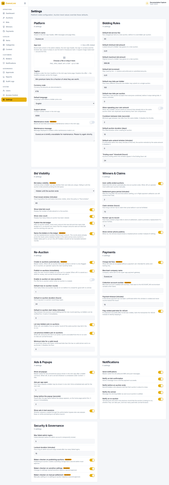

*58 platform settings in nine groups. Every control carries its own explanation, so the
page documents itself.*

| Group | Settings | What it controls |
| --- | --- | --- |
| **Platform** | 8 | Platform name, app icon, tagline, currency, default language, support phone, and **maintenance mode** with its customer-facing message |
| **Bidding Rules** | 11 | Default fee, bid range, increment, per-bidder and per-auction caps, whether a bidder may repeat their own amount, cooldown between bids, default duration, auto-extend window, "ending soon" threshold |
| **Bid Visibility** | 6 | Bid status visibility (the reveal policy), final reveal window, whether to show total bid count and view count, and whether to publish the bid ledger after settlement — with or without naming bidders |
| **Winners & Claims** | 5 | Auto-settle, settlement grace period, claim window length, how many runner-ups to record, whether to show the winner's masked phone publicly |
| **Re-Auction** | 9 | Whether rounds are created and published automatically, whether re-auction is pre-filled on new auctions, round limit, duration, start delay, who may join, and the turnout floor |
| **Payments** | 5 | Whether bid fees are charged at all, merchant name and account, pending-payment timeout, refund flagging for late payments |
| **Ads & Popups** | 4 | Whether ad popups show, how many per app open, the delay before one appears, and whether test sessions see them |
| **Notifications** | 5 | The master switch for outbound SMS and push, plus per-event toggles for bid confirmation, ending soon, winner announcement and re-auction |
| **Security & Governance** | 5 | Max failed admin logins, lockout duration, and the maker-checker toggles for publishing auctions, sensitive settings and manual settlement |

Settings marked with an orange **Sensitive** badge are the ones that route through
maker-checker when that is switched on.

> **`Charge bid fees` is a live switch.** With it off, bids are accepted without a payment
> call at all — intended for pilots and testing, not production.

Two rules govern this page:

- **Settings supply the starting point, not the law.** An auction-level value always
  overrides the platform default.
- **Settings marked sensitive route through maker-checker** when
  `security.requireApprovalForSettings` is on — the change lands in
  [Approvals](#23-approvals) instead of applying.

### The scheduled tick

One maintenance pass advances `SCHEDULED → LIVE → ENDED`, voids unpaid bids past their
timeout, auto-settles ended auctions past the grace period, opens re-auction rounds,
notifies winners and carried-forward bidders, and sends "ending soon" reminders. Every
step is idempotent, so a missed or duplicated pass is harmless.

Three things drive it, deliberately overlapping:

| Driver | How | When to use it |
| --- | --- | --- |
| **Cron** | `POST /api/cron/tick` with the `x-cron-secret` header, every minute | A platform scheduler is available |
| **Worker** | `npm run run:worker` as a supervised process | Plain `next start`, no scheduler |
| **Read paths** | Automatic — every auction read triggers a pass | Always on, the safety net |

Run the cron or the worker **for punctuality, not for correctness**. Without either,
settlement still happens via the read paths, but only while the app is being used — so
an auction that ends overnight would not settle until someone opens it.

---

# Part C — Reference

## 29. Status glossary

**Auction**

| Status | Meaning |
| --- | --- |
| `DRAFT` | Created, not public |
| `PENDING_APPROVAL` | Waiting on maker-checker before publishing |
| `SCHEDULED` | Published, start time not reached |
| `LIVE` | Accepting bids |
| `ENDED` | Closed, not yet settled. **Amounts stay masked** |
| `SETTLED` | Result computed and published |
| `CANCELLED` | Withdrawn. Auctions that have been public are cancelled, never deleted |

**Bid**

| Status | Meaning |
| --- | --- |
| `PENDING_PAYMENT` | Placed, fee not yet confirmed. **Does not count** |
| `ACTIVE` | Fee confirmed. Counts toward the result |
| `FAILED` | The fee collection failed |
| `VOID` | Voided — typically a pending bid that timed out |
| `REFUNDED` | Fee returned |

**Payment**

| Status | Meaning |
| --- | --- |
| `PENDING` | Awaiting the gateway |
| `SUCCESS` | Collected |
| `FAILED` | Declined |
| `EXPIRED` | Timed out before the customer approved it |
| `REVERSED` | Landed after its bid was voided; flagged for refund |

**Winner** — `PENDING_CLAIM`, `CLAIMED`, `VERIFIED`, `FULFILLED`, `FORFEITED`, `CANCELLED`.

**Bidder** — `ACTIVE`, `SUSPENDED`, `BLOCKED`.

**Re-auction state** — `NONE` (not settled yet), `NOT_NEEDED` (settled with a winner),
`PENDING` (flagged, waiting for an operator), `CREATED` (round opened), `EXHAUSTED`
(round limit used up), `DISABLED` (switched off for this auction), `BLOCKED` (the rules
leave nobody able to bid in a re-run).

---

## 30. Roles at a glance

Six roles ship with the platform:

| Role | Intended for |
| --- | --- |
| **Super Admin** | Full access, bypasses every check. Also the only role that can reach Users and Access Control |
| **Auction Manager** | Runs the catalogue and the auction lifecycle |
| **Approver** | The second pair of eyes — settlement, pending changes, manual payment confirmation |
| **Finance** | Payments and reports |
| **Support** | Bidder-facing: accounts, claims, questions |
| **Auditor** | Read-only, including the audit log |

Roles are fully editable, and new ones can be created, in
[Access Control](#27-access-control).

---

## 31. Messages the platform sends

All templates are bilingual and editable under **Notifications → Templates**.

| Code | Sent when |
| --- | --- |
| `BID_CONFIRMED` | A bid's fee is confirmed and the bid becomes active |
| `BID_FAILED` | A bid's fee collection failed |
| `AUCTION_ENDING` | An auction is inside the "ending soon" threshold |
| `AUCTION_SETTLED` | An auction's result is published |
| `WINNER_ANNOUNCED` | A bidder has won and the claim window has opened |
| `WINNER_REMINDER` | A claim window is running out |
| `PRIZE_FULFILLED` | A prize has been delivered |
| `AUCTION_REAUCTIONED` | A new round has opened, with how many paid bids carried over |
| `REAUCTION_EXCLUDED` | A new round has opened that the recipient may not take part in |

---

## 32. Troubleshooting

**An auction ended but never settled.**
Check the **Awaiting settlement** tile on the dashboard. Settlement runs on the
maintenance pass; if no cron or worker is scheduled, it only runs when someone uses the
app. Either schedule one, or open the auction to trigger a pass. If settlement is failing
rather than not running, the audit log will carry an `AUCTION_SETTLEMENT_BLOCKED` entry —
that means a bid's stored amount could not be opened, and settlement deliberately stops
rather than dropping the bid and handing the prize to the wrong person.

**A bid was placed but is not counted.**
It is probably `PENDING_PAYMENT`. A bid only counts once its fee is confirmed. Check
[Payments](#18-payments) for the transaction.

**A customer says they were charged twice for the same bid.**
They should not have been — carried-forward bids in a re-auction chain record a zero fee,
and a credit is spent by a single conditional update so two concurrent bids can never
spend the same one. Check the auction's re-auction chain
([section 15](#the-re-auction-chain)) for their carried bids and how many remain unspent.

**Amounts show as `•••` in the console.**
That is correct while the auction is `LIVE` or `ENDED`. Amounts open at `SETTLED`, and
not before. Use the **Provisional result** panel to see the *shape* of the outcome
without the amounts.

**Messages are not arriving.**
Until `SMS_API_URL` is configured, messages are logged rather than sent. Check
**Notifications → Delivery log**: if the entries are there, the templates and triggers
are working and only the transport is missing.

**An orange bar says the session is a test.**
`ALLOW_TEST_LOGIN` is enabled. That is fine in UAT and must be off in production.

---

## Appendix — About the screenshots

Every screenshot in this manual was captured from the running application against a
populated database. The mini-app was captured at a 414 × 860 mobile viewport, matching a
super-app webview; the console at 1440 × 900.

The console screenshots were taken with a temporary Super Admin account named
*Documentation Capture*, which is why that name appears in the top-right of each one and
why the Access Control screenshot counts two Super Admins. The account existed only for
the capture.

The bids on auction **#197** visible in the live-auction screenshots were placed through
the real bidding flow in a test session. They carry `channel = TEST` and a zero fee, and
can be removed by deleting bids where `channel = 'TEST'`.

The **Payments** table is empty for the same reason — test sessions skip the payment
gateway entirely. In production that table carries one row per fee collection.
